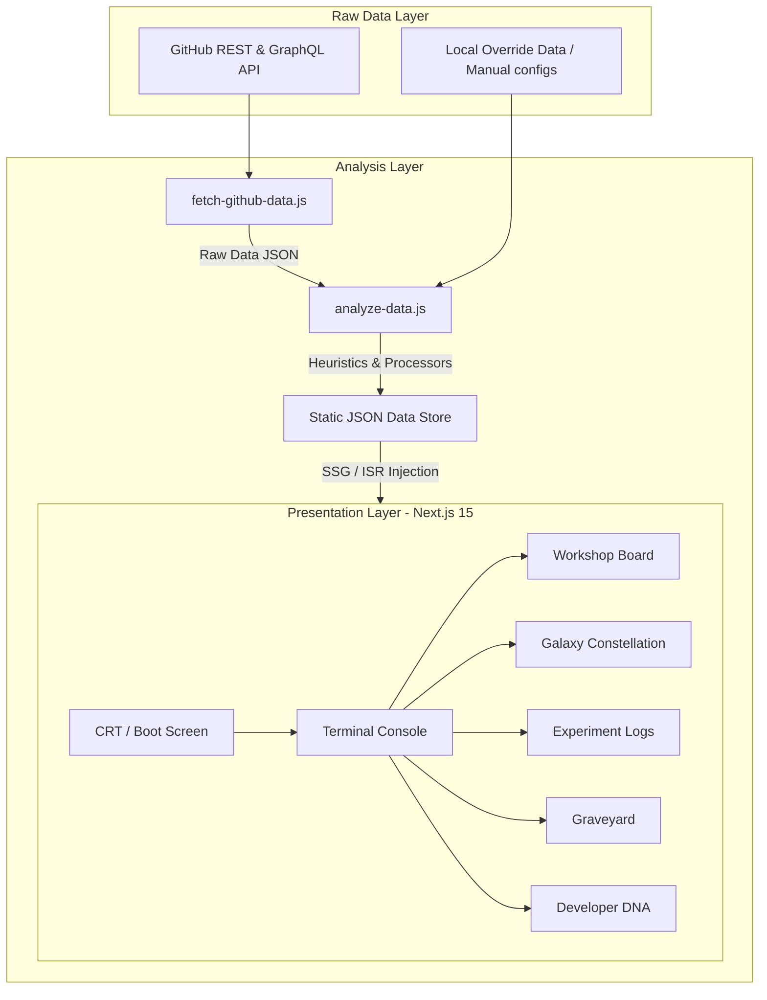
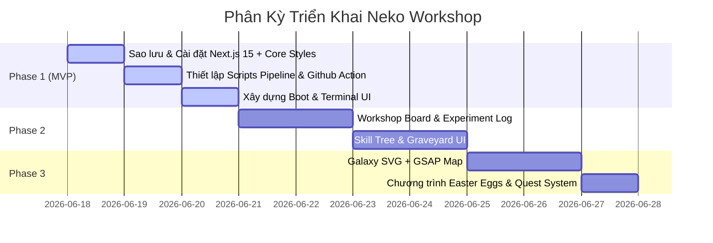

# Neko's Workshop - Thiết Kế Kiến Trúc & Ý Tưởng Sản Phẩm (Architecture & Product Review)

Hồ sơ tài liệu này được biên soạn bởi Kiến trúc sư Phần mềm (Software Architect), Nhà thiết kế Sản phẩm (Product Designer) và Trưởng nhóm Kỹ thuật (Technical Lead) nhằm phản biện, tối ưu hóa và hoàn thiện cấu trúc hệ thống của **Neko's Workshop** (nekovibecoder.site).

---

## 1. Phản Biện Ý Tưởng Sản Phẩm (Concept Review)

### 1.1. Điểm mạnh (What is strong?)
- **Mô hình "Living Profile"**: Thay thế CV tĩnh truyền thống bằng một hệ sinh thái động. Website phản ánh thực tế thói quen của lập trình viên (code nhiều trên GitHub, ít viết bài mạng xã hội).
- **Tập trung vào "Tiến trình" hơn "Kết quả"**: Hiển thị cả những dự án thất bại (Graveyard) và nhật ký thí nghiệm (Experiment Log) tạo cảm giác chân thực và đáng tin cậy.
- **Tận dụng tối đa Automation**: Toàn bộ dữ liệu tự động đồng bộ qua GitHub Actions, giải phóng lập trình viên khỏi việc cập nhật thủ công.

### 1.2. Điểm yếu (What is weak?)
- **Quá phụ thuộc vào GitHub Metadata**: Nếu lập trình viên commit thiếu cẩn thận hoặc đặt tên dự án mơ hồ, dữ liệu hiển thị sẽ kém chất lượng.
- **Trải nghiệm CRT/Terminal thuần tùy có thể gây mệt mỏi**: Một số khách truy cập (như HR hoặc nhà tuyển dụng bận rộn) cần tìm thông tin nhanh sẽ thấy khó chịu nếu phải gõ lệnh hoặc chờ hoạt ảnh boot quá lâu.
- **Thiếu tính tương tác thực tế**: Hiện tại trang web chỉ là kênh hiển thị một chiều (Read-only), chưa có tính năng để khách truy cập "chơi" hay tương tác sâu.

### 1.3. Điểm mang lại cảm giác phổ thông (What feels generic?)
- **Thiết kế màu sắc Cyberpunk / Retro Terminal**: Giao diện dòng lệnh CRT màu xanh neon khá phổ biến trong cộng đồng lập trình viên.
- **Bảng Kanban (Workshop Board)**: Layout Kanban 3 cột rất quen thuộc, dễ bị nhầm lẫn với các trang web quản lý công việc tiêu chuẩn.
- **Bảng kỹ năng (Skill Tree)**: Hiển thị các sao/cấp độ kỹ năng (như Next.js: 5 sao) vẫn mang hơi hướng của các portfolio mẫu thông thường.

### 1.4. Điểm độc đáo (What feels unique?)
- **Developer DNA (Phân tích chỉ số tính cách lập trình)**: Phân loại kiểu người (Builder, Researcher, Automator) dựa trên cấu trúc đóng góp thực tế trên Git.
- **Nghĩa trang dự án (Graveyard)**: Việc trưng bày các dự án thất bại và rút ra bài học (Lessons Learned) là điều cực kỳ hiếm thấy và tạo ấn tượng mạnh về tính trung thực.
- **Galaxy Project Map**: Trực quan hóa chòm sao liên kết công nghệ, biến danh sách dự án thành một bản đồ thiên hà tương tác.

### 1.5. Đề xuất loại bỏ (What should be removed?)
- **Đánh giá cấp độ kỹ năng theo số sao (Star/Level ratings)**: Loại bỏ các thanh phần trăm hay mức độ "Junior/Senior". Kỹ năng phải được chứng minh bằng các dự án liên kết thực tế trên cây.
- **Form liên hệ truyền thống**: Loại bỏ các form điền thông tin gửi email rườm rà. Thay bằng tích hợp cổng CLI liên kết hoặc shortcut Discord/Mail trực tiếp.
- **Mô tả học thuật rập khuôn**: Loại bỏ các phần giới thiệu kiểu "Tôi là một lập trình viên năng động, sáng tạo...". Hãy để dữ liệu tự nói lên điều đó.

### 1.6. Đề xuất bổ sung (What should be added?)
- **Cổng tương tác trực tiếp với Agent (Inter-Agent Portal)**: Một widget giả lập chạy nền cho thấy Agent đang thực hiện các tác vụ phân tích dữ liệu thực tế.
- **Hệ thống Nhiệm vụ (Quest System) dành cho khách**: Khách truy cập có thể mở khóa các "Thành tựu ẩn" trên website (ví dụ: gõ lệnh bí mật, tìm thấy Easter Egg trong Galaxy).
- **Phân tích Heuristic nâng cao**: Tự động trích xuất "Problem/Solution/Outcome" từ file README của repo thay vì dùng text mẫu.

### 1.7. Điểm cốt lõi khiến khách truy cập ghi nhớ (The WOW Factor)
Khách truy cập sẽ nhớ đến website vì:
> "Trang web này không chào hàng để tuyển dụng. Nó là một phòng thí nghiệm đang chạy, nơi tôi thấy các Agent đang làm việc, các dự án thất bại được chôn cất trang nghiêm, và các hành tinh dự án đang quay quanh lõi công nghệ."

---

## 2. Kiến Trúc Thông Tin & Luồng Dữ Liệu (Information Architecture)



### 2.1. Sitemap (Sơ đồ trang)
- `/` (Boot Screen & Terminal Console - Trung tâm điều khiển)
- `/workshop-board` (Bảng phân loại Kanban)
- `/galaxy` (Tinh vân chòm sao dự án tương tác)
- `/experiment-log` (Báo cáo thí nghiệm chi tiết)
- `/graveyard` (Nghĩa trang dự án thất bại)
- `/skill-tree` (Bản đồ tiến hóa công nghệ)
- `/achievements` (Milestone & Huy chương)
- `/brain` (Trạng thái Agent tư duy & Học tập)

### 2.2. User Flow (Luồng trải nghiệm người dùng)
1. **Khởi động**: Khách vào `/` -> Trải nghiệm hiệu ứng Boot (máy tính khởi động).
2. **Khám phá**: Chuyển tiếp vào giao diện Terminal. 
   - Khách thích CLI: Gõ lệnh để xem.
   - Khách thích GUI: Click vào các tab định hướng nhanh trên Header.
3. **Tương tác**: Khách rê chuột vào các hành tinh trong Galaxy để xem thông số, hoặc lọc dự án trên Kanban Board.
4. **Mở khóa**: Gõ lệnh bí mật (ví dụ: `cat secret.txt`) hoặc click vào Easter Egg để nhận huy chương ẩn.

---

## 3. Phản Biện & Đánh Giá Các Module (Module Evaluation)

| Module | Đánh giá | Đề xuất tối ưu / Thay thế | Lý do |
| :--- | :--- | :--- | :--- |
| **Workshop Board** | Khá phổ thông | **Tối ưu**: Thay đổi giao diện từ Kanban văn phòng sang bảng điều khiển thiết bị (Control Panel), hiển thị trạng thái tài nguyên của server. | Tăng tính giả lập phòng thí nghiệm. |
| **Current Brain** | Rất độc đáo | **Giữ lại & Nâng cấp**: Hiển thị các luồng suy nghĩ (Thought Streams) dạng log thời gian thực của Agent thay vì chatbot hỏi đáp thông thường. | Chatbot OpenAI tốn token và dễ bị spam. Luồng suy nghĩ tĩnh (dựa trên hoạt động gần nhất) sẽ rẻ và an toàn hơn. |
| **Timeline** | Dễ gây nhàm chán | **Tối ưu**: Biến timeline thành các "Kỷ nguyên địa chất" (Geological Eras) của dự án thay vì phân chia năm thông thường. | Tăng tính game hóa (Gamification). |
| **Experiment Log** | Rất tốt | **Giữ lại**: Cấu trúc hóa rõ ràng theo chuẩn báo cáo khoa học (Problem/Solution/Outcome). | Giúp nhà tuyển dụng hiểu tư duy giải quyết vấn đề của dev. |
| **Skill Tree** | Dễ bị generic | **Tối ưu**: Thiết kế dạng đồ thị liên kết (Skill Graph) tích hợp các node điều kiện (ví dụ: mở khóa node n8n sau khi hoàn thành 2 dự án automation). | Tránh việc đánh giá kỹ năng chủ quan bằng điểm số hoặc số sao. |
| **Graveyard** | Độc đáo nhất | **Giữ lại**: Đưa vào biểu tượng bia mộ cổ điển kèm bài học kinh nghiệm sâu sắc. | Tạo sự tin cậy và ấn tượng khác biệt hoàn toàn. |
| **Galaxy Graph** | Rất mạnh | **Giữ lại**: Sử dụng biểu đồ mạng liên kết (Planet Orbit) để người dùng thấy tính kết nối của hệ thống. | Tối ưu hóa thị giác cực tốt. |

---

## 4. Thiết Kế Bộ Phân Tích Dữ Liệu (Analyzer Architecture)

Hệ thống sẽ chạy 6 bộ phân tích chuyên biệt (Analyzers) để xử lý dữ liệu thô từ GitHub:

### 1. Timeline Analyzer
- **Đầu vào**: Ngày khởi tạo repo, lịch sử commit messages.
- **Đầu ra**: `timeline.json` (Danh sách Eras, các công nghệ chủ đạo của thời kỳ đó).
- **Trách nhiệm**: Phân nhóm thời gian hoạt động thành các kỷ nguyên phát triển.
- **Tần suất**: Hàng ngày (24 giờ một lần).

### 2. Brain (Thought) Analyzer
- **Đầu vào**: Commit messages mới nhất trong 30 ngày, các topic được gắn thẻ gần đây.
- **Đầu ra**: `brain.json` (Luồng suy nghĩ hiện tại: Neko đang nghiên cứu gì, quan tâm đến thư viện nào).
- **Trách nhiệm**: Tổng hợp và suy luận từ hoạt động gần nhất để tạo ra văn bản tóm tắt "Neko đang nghĩ gì".
- **Tần suất**: Hàng ngày.

### 3. Galaxy Linker (Graph Generator)
- **Đầu vào**: Tên repo, primary languages, list topics.
- **Đầu ra**: `galaxy.json` (Nodes & Links).
- **Trách nhiệm**: Xây dựng ma trận liên kết giữa các dự án. Nếu hai repo chung >1 topic hoặc cùng ngôn ngữ chính, tạo một liên kết (Edge).
- **Tần suất**: Hàng ngày.

### 4. Skill Tree Progressor
- **Đầu vào**: Dữ liệu từ `galaxy.json` và `raw-github-data.json`.
- **Đầu ra**: `skill-tree.json` (Trạng thái mở khóa của các nhánh kỹ năng).
- **Trách nhiệm**: Tính toán cấp độ kỹ năng dựa trên số lượng repo và commit tương ứng (ví dụ: ≥3 repo Next.js = Mở khóa "Next.js Mastery").
- **Tần suất**: Hàng ngày.

### 5. Repository Classifier
- **Đầu vào**: Trạng thái repo (Archived/Active), topics, descriptions.
- **Đầu ra**: `workshop-board.json` (Phân loại vào các cột Research, Building, Archived).
- **Trách nhiệm**: Tự động phân loại dự án mà không cần dev can thiệp thủ công.
- **Tần suất**: Hàng ngày.

---

## 5. Phân Kỳ Phát Triển (Feature Prioritization)



### Phase 1: MVP (Hệ thống cốt lõi & Pipeline)
- **Mục tiêu**: Thiết lập hạ tầng Next.js, pipeline tự động kéo dữ liệu từ GitHub và giao diện dòng lệnh cơ bản.
- **Tính năng**: Boot screen, Terminal CLI (`help`, `whoami`), scripts fetch & analyze dữ liệu.
- **Độ phức tạp / Effort**: Thấp (3 ngày).

### Phase 2: Visual Dashboard (Bảng điều khiển trực quan)
- **Mục tiêu**: Xây dựng giao diện đồ họa để hiển thị thông tin trực quan mà không bắt buộc người dùng gõ lệnh.
- **Tính năng**: Workshop Board (Kanban), Experiment Log, Graveyard ( RIP layout), Skill Tree.
- **Độ phức tạp / Effort**: Trung bình (4 ngày).

### Phase 3: Interactive Constellation (Bản đồ tương tác)
- **Mục tiêu**: Hoàn thiện Galaxy Map và tích hợp các chuyển động mượt mà của GSAP.
- **Tính năng**: Galaxy SVG Graph tương tác (zoom, click, hover panel), Easter Eggs, quest system cơ bản.
- **Độ phức tạp / Effort**: Cao (3 ngày).

### Phase 4: AI Agent Integration (Tương lai)
- **Mục tiêu**: Tích hợp mô hình ngôn ngữ lớn để tự động viết tóm tắt dự án từ README/commits.
- **Tính năng**: OpenAI GPT pipeline generator, live Agent status stream.
- **Độ phức tạp / Effort**: Cao (Phụ thuộc vào khóa API và chi phí).

---

## 6. Cấu Trúc Thư Mục Sản Xuất (Production File Structure)

Cấu trúc thư mục được thiết kế để đảm bảo tính modular, dễ mở rộng và tách biệt rõ ràng giữa logic pipeline và giao diện frontend:

```text
/
├── .github/
│   └── workflows/
│       └── neko-data.yml      # Workflow tự động chạy pipeline hàng đêm
├── .plan/
│   └── architecture-review.md # Tài liệu kiến trúc và phản biện sản phẩm
│   └── guide.md               # Tài liệu hướng dẫn kỹ thuật chi tiết
├── docs/                      # Các tài liệu hỗ trợ khác (nếu có)
├── scripts/
│   ├── fetch-github-data.js   # Script kết nối và kéo dữ liệu thô từ GitHub API
│   └── analyze-data.js        # Script điều phối các bộ phân tích dữ liệu
├── src/
│   ├── app/                   # Next.js App Router
│   │   ├── layout.tsx         # Khởi tạo HTML, font, CSS toàn cục
│   │   ├── page.tsx           # Entrypoint: Boot sequence & Terminal
│   │   ├── timeline/          # Trang dòng thời gian kỷ nguyên
│   │   ├── workshop-board/    # Trang bảng công việc Kanban
│   │   ├── experiment-log/    # Trang nhật ký thí nghiệm
│   │   ├── graveyard/         # Trang nghĩa trang dự án thất bại
│   │   ├── skill-tree/        # Trang cây kỹ năng game hóa
│   │   └── galaxy/            # Trang bản đồ tinh vân dự án
│   ├── components/            # Các UI components tái sử dụng
│   │   ├── Terminal.tsx       # Component Terminal console
│   │   ├── BootSequence.tsx   # Component hiệu ứng khởi động hệ thống
│   │   └── LayoutWrapper.tsx  # Layout bao ngoài với CRT, scanline và status header
│   ├── data/                  # Thư mục lưu trữ JSON tĩnh đầu ra của pipeline
│   │   ├── timeline.json
│   │   ├── dna.json
│   │   ├── galaxy.json
│   │   ├── achievements.json
│   │   └── changelog.json
│   └── types/                 # Định nghĩa kiểu TypeScript toàn hệ thống
│       └── index.ts
├── package.json
├── tsconfig.json
└── tailwind.config.ts
```

- **/scripts**: Độc lập hoàn toàn với Next.js, chạy bằng Node.js thuần trong GitHub Actions để tránh làm phình to build size của frontend.
- **/src/data**: Nơi chứa dữ liệu JSON tĩnh được cập nhật hàng đêm. Next.js đọc trực tiếp từ đây lúc build giúp tối ưu hóa SEO và hiệu suất tối đa.
- **/src/components**: Đảm bảo tính tái sử dụng, cô lập logic hiển thị và hoạt ảnh GSAP để dễ bảo trì.
