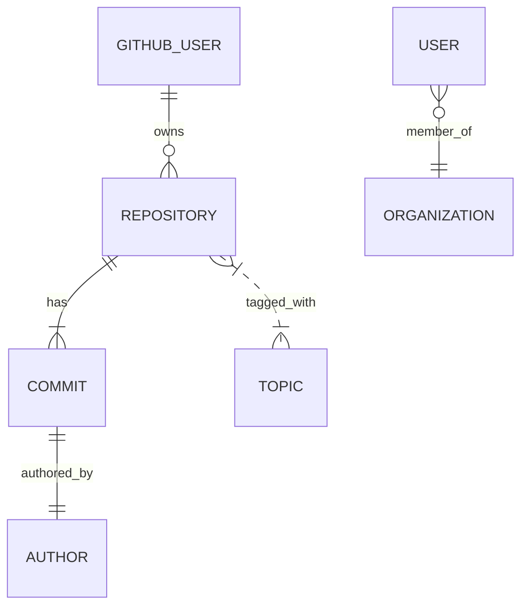

# Tóm tắt Dự án “Neko’s Workshop” (nekovibecoder.site)

**Mục tiêu:** Xây dựng một trang web “nhân bản số” (living profile) của lập trình viên, mô phỏng phòng thí nghiệm của “Neko Vibe Coder”, thay vì portfolio truyền thống. Website tự động cập nhật hoàn toàn từ hoạt động trên GitHub (commits, repo mới, v.v.). Người truy cập cảm giác như đang khám phá một hệ thống tương tác: có màn khởi động, bảng điều khiển chế độ terminal, các mô-đun game hóa (bảng công việc, nhật ký thí nghiệm, kỹ năng, thành tựu, bản ghi cuộc đời, v.v.). Toàn bộ dữ liệu đều lấy từ GitHub; cập nhật tự động bằng GitHub Actions; giao diện hiện đại (Next.js 15 + Tailwind + Framer Motion).

**Tiêu chí chấp nhận (Acceptance Criteria):**
- **Dynamic từ GitHub:** Mọi thông tin (dòng thời gian, dự án, kỹ năng, trạng thái hiện tại, thành tựu…) được tổng hợp từ API GitHub (REST/GraphQL) qua workflow tự động; sau mỗi cập nhật, site rebuild tự động.
- **Không cần nhập liệu thủ công:** Sau khi tích hợp, không cần sửa HTML/React; chỉ cần push lên GitHub là các trang được cập nhật (ví dụ thêm repository mới tự động hiện).
- **Chạy nhanh, thân thiện:** Sử dụng Next.js static site generation để điểm hiệu năng cao (Lighthouse >95/100 các chỉ số Performance, Accessibility, Best Practices, SEO).
- **Responsive, tối ưu thiết bị di động:** Thiết kế tối ưu cho mọi kích thước, tận dụng Tailwind CSS để responsive.
- **Bảo mật & quyền riêng tư:** Dùng token bí mật (`GITHUB_TOKEN`) lưu trong GitHub Actions; chỉ hiển thị dữ liệu công khai. Không đưa form đăng nhập hay xử lý thông tin nhạy cảm của người dùng.

## Sơ đồ trang (Sitemap) và UX

- **/** (Trang landing / boot): Màn hình khởi động (giống máy tính boot). Ví dụ:
  ```
  Booting Neko.OS...
  Loading repositories...
  Loading research logs...
  System Ready.

  visitor@neko:~$
  ```
  Sau khi “boot” xong sẽ hiển thị prompt terminal nhấp nháy.
- **/terminal**: Giao diện terminal tương tác. Người dùng có thể gõ `help` để xem các lệnh khả dụng (ví dụ: `whoami`, `timeline`, `workshop-board`, `experiment-log`, `graveyard`, `skill-tree`, `brain`, `galaxy`, `lab`, `changelog`, `achievements`). Gõ mỗi lệnh hiển thị nội dung tương ứng. Ví dụ:
  ```
  visitor@neko:~$ help

  whoami         -> Thông tin về Neko (AI-generated)
  timeline       -> Dòng thời gian phát triển
  workshop-board -> Bảng công việc (trang thái hiện tại)
  experiment-log -> Nhật ký thí nghiệm
  graveyard      -> Kho đồ án thất bại
  skill-tree     -> Cây kỹ năng
  brain          -> Brain (nghĩ gì, AI trả lời)
  galaxy         -> Bản đồ kho dự án (đồ thị)
  lab            -> Các dự án (nhiệm vụ), hiển thị Problem/Solution/Outcome
  changelog      -> Nhật ký phát hành (cuộc đời)
  achievements   -> Thành tựu, milestone
  ```
- **/workshop-board**: Giả lập “bảng công việc” kiểu kanban trong phòng thí nghiệm. Chia thành các cột (🧪 Research, ⚙️ Building, 📦 Archived). Mỗi mục lấy từ metadata GitHub (topics, projects). Ví dụ:
  - **Research:** Neko đang nghiên cứu MCP, AI Agent, Odoo…
  - **Building:** Dự án đang xây dựng (các repo mới nhất).
  - **Archived:** Dự án hủy/đóng cũ (dựa vào repo archived).
- **/experiment-log**: Danh sách “thí nghiệm” (mỗi thí nghiệm tương ứng repo). Với từng mục:
  ```
  Experiment #27: Học MCP

  Mục tiêu:
    - Nghiên cứu tính năng X của Odoo.
  Kết quả:
    - Viết được chức năng Y bằng API mới.
  Bài học:
    - Nên dùng Z để tối ưu performance.
  ```
  Mỗi phần có thể do AI sinh dựa trên README hoặc commit của repo.
- **/graveyard**: Liệt kê các “dự án thất bại” hoặc ý tưởng từ chối (Dự án đã archive, hoặc code hủy). Ví dụ:
  ```
  ⚰️ Dự án “Xịt Học Odoo”
    - Lý do thất bại: Quá phức tạp, viết nhanh không thành công.
    - Bài học: Tập trung vào microservice, không over-engineer.
  ```
  Giúp hiển thị tính minh bạch và cái nhìn thật về quá trình học tập.
- **/skill-tree**: Cây kỹ năng game hóa. Nhóm theo chuyên môn/chủ đề:
  ```
  ── Automation ── GitHub Actions
                 Jenkins
                 Cron Jobs
  ── AI/ML ───── LLMs (OpenAI)
                 Torch, Scikit-learn
  ── Odoo ────── CRM, HR, POS modules
  ── GameDev ── Minecraft Modding
  ```
  Kỹ năng có thể “mở khóa” khi có repo/thời gian hoạt động tương ứng. (Không phải bảng tròn trình độ; mà dạng cây/hồ sơ phát triển).
- **/brain**: “Trí não Neko” – chatbot hoặc hiển thị trạng thái hiện tại. Người dùng có thể nhập câu hỏi (ví dụ “What is Neko learning?”) và AI trả lời dựa trên dữ liệu GitHub gần nhất. Ví dụ:
  ```
  visitor@neko:~$ brain "What am I focusing on?"

  Neko@home: Em đang tập trung phát triển AI Agent. Trong tháng qua, 70% hoạt động (commits) của em liên quan đến dự án Agent và MCP.
  ```
  Hoặc hiển thị auto-generated summary: “Trí não Neko hiện nghĩ về MCP, Agent memory, Odoo...”.
- **/timeline**: **Dòng thời gian phát triển**. Tự động phân tích lịch sử hoạt động GitHub (commits, repo, stars) để chia thành các “kỷ nguyên” (era) theo năm hoặc giai đoạn. Ví dụ:
  ```
  2023 ─── The Learning Era
  2024 ─── The Odoo Era
  2025 ─── The Automation Era
  2026 ─── The Agent Era
  ```
  Chọn từng kỷ nguyên sẽ mở ra chi tiết: 
  - Danh sách repo tiêu biểu
  - Công nghệ chính sử dụng
  - Số lượng commit/hoạt động
  - Mô tả tóm tắt (AI-generated) về giai đoạn đó.
  Ví dụ tab “2024 (Odoo Era)” hiển thị:
  ```
  Key Repositories: [Odoo-HR-Module (120★), Odoo-POS (80★), ...]
  Commits: 1500+
  Languages: Python, JavaScript
  Technologies: Odoo framework, PostgreSQL, GitHub Actions
  Summary: Trong năm 2024, Neko tập trung xây dựng ERP với Odoo. Bạn đã tạo 5 module Odoo, tích hợp CI/CD cho testing... 
  ```  
  *(Mô tả này do AI sinh từ commit message/changelog)*.
- **/galaxy**: Bản đồ “vũ trụ dự án”. Mỗi repository là một “hành tinh” (node). Các repos chung chủ đề hoặc connect (cùng topic, tương tác, contributors chung) được nối với nhau (edges). Có thể zoom/pan/hover:
  - Node: tên repo, size theo sao (stars).
  - Edge: kết nối theo chủ đề (ví dụ “AI”, “Odoo”, “Game”).
  - Color/symbol khác nhau cho từng nhánh (AI – xanh, Odoo – cam, Game – tím...).
  Ví dụ mô hình: thấy rõ 3 cụm: AI, Odoo, Minecraft. Đồ thị chạy trên Canvas/WebGL (dùng thư viện *react-force-graph* hoặc *d3-force*).
- **/lab**: Giới thiệu dự án đang phát triển (Labs là các “nhiệm vụ”). Mỗi dự án (repo) được trình bày theo cấu trúc:
  ```
  Tên dự án (Repository)
    - Problem: Mô tả vấn đề/ý tưởng (từ README hoặc first commit).
    - Solution: Hướng giải quyết (tóm tắt chức năng chính).
    - Outcome: Kết quả đạt được (ví dụ “Đã hoàn thành 80% chức năng”).
    - Lessons: Những điều học được (auto-generated).
  ```
  Ví dụ:
  ```
  AI Chatbot (repo: ai-chatbot)
    - Problem: Cần chatbot hỗ trợ tư vấn tự động.
    - Solution: Xây dựng với GPT-4o API kết hợp danh sách FAQs.
    - Outcome: Chatbot xử lý 75% câu hỏi thường gặp, deploy qua Netlify.
    - Lessons: Học cách gọi API, quản lý state, deploy serverless.
  ```
  Nội dung “Problem/Solution/Outcome” có thể do AI phân tích README commit history để viết lại thành văn.
- **/changelog**: Nhật ký “phát hành” cuộc đời mỗi tháng (hoặc quý). Giống release notes phần mềm nhưng ghi lại tiến trình:
  ```
  v2026.06 – Tháng 6/2026
  + Học MCP (Modular Computer Physics) 
  + Xây dựng AI Agent (tiến hành phiên bản 0.3)
  + Tích hợp CI/CD cho dự án Odoo POS
  - Đóng khoá ý tưởng Plugin Minecraft (kéo dài 3 tháng, vì ưu tiên AI)
  ```
  Dữ liệu lấy từ tag ngày tháng của các commit, milestone hoặc giới hạn date, do AI tổng hợp.
- **/achievements**: Các cột mốc quan trọng (Achievements/Trophies). Ví dụ: 
  ```
  🏆 First Repository (Jan 2023)
  🏆 First 100 Commits
  🏆 10 Repositories (Oct 2024)
  🏆 1000 Commits (May 2025)
  🏆 First Open Source PR (Mar 2024)
  🏆 First AI Project Deployed (Apr 2025)
  ```
  Sự kiện xác định từ ngày tạo repo, số lượng commits đạt mốc, number of stars đạt ngưỡng, v.v. (Tự động từ dữ liệu).
- **/api**: API nội bộ trả về các JSON (raw-data hoặc derived), như `/api/timeline`, `/api/dna`, `/api/galaxy`, `/api/achievements`, `/api/changelog`. Ví dụ yêu cầu GET `/api/timeline` trả về file JSON `timeline.json` (do workflow sinh ra).

## Mô hình Dữ liệu (Data Model)

### Dữ liệu thô (Raw Data)
- **Repositories:** Lấy từ GitHub API (REST hoặc GraphQL). Mỗi repo gồm: tên, mô tả, ngày tạo, ngôn ngữ chính, stars, forks, topics.
- **Commits:** Số lượng commit hàng tháng, commit messages quan trọng, mới nhất.
- **Stars:** Lịch sử star (có thể lấy qua GraphQL).
- **Issues/PR:** (tùy chọn) đếm số issue đóng, PR merged.

**Ví dụ (raw-data.json)**:
```json
{
  "repos": [
    {
      "name": "Neko-MCP-Demo",
      "created_at": "2025-09-10",
      "topics": ["MCP","GameDev","Odoo"],
      "stars": 42,
      "language": "Python",
      "archived": false
    },
    {
      "name": "Neko-Old-Plugin",
      "created_at": "2024-06-01",
      "topics": ["Minecraft","Abandoned"],
      "stars": 0,
      "language": "Java",
      "archived": true
    }
    // ...
  ],
  "commits": [
    {"repo": "Neko-MCP-Demo", "month": "2026-05", "count": 120},
    {"repo": "Neko-Old-Plugin", "month": "2024-06", "count": 5}
  ],
  "activities": [
    {"type": "issue", "repo": "Neko-MCP-Demo", "action": "closed", "date": "2026-05-15"},
    {"type": "pull_request", "repo": "Neko-MCP-Demo", "action": "merged", "date": "2026-05-16"}
  ]
}
```

### Dữ liệu sơ bộ (Derived Data JSON)
Các file JSON sẽ được sinh bởi scripts phân tích:

- **timeline.json**: Chia theo năm hoặc era. Có định dạng ví dụ:
```json
{
  "eras": [
    {
      "year": 2024,
      "title": "Odoo Era",
      "start_date": "2024-01-01",
      "end_date": "2024-12-31",
      "repos": ["Neko-Odoo-CRM", "Neko-Odoo-HR"],
      "commits": 1200,
      "description": "Năm 2024 tập trung phát triển hệ thống ERP Odoo. ...",
      "technologies": ["Odoo", "Python", "PostgreSQL"]
    },
    {
      "year": 2025,
      "title": "Automation Era",
      "start_date": "2025-01-01",
      "end_date": "2025-12-31",
      "repos": ["Neko-CI-Templates", "Neko-Action-Scripts"],
      "commits": 1500,
      "description": "Năm 2025 tập trung tự động hóa (CI/CD, scripts). ...",
      "technologies": ["GitHub Actions", "Next.js", "Tailwind CSS"]
    }
  ]
}
```

- **dna.json** (Developer DNA): Phân tích “phẩm chất/kiểu người lập trình”. Ví dụ:
```json
{
  "traits": [
    {"name": "Builder", "score": 92},
    {"name": "Researcher", "score": 80},
    {"name": "Automator", "score": 88},
    {"name": "Designer", "score": 20}
  ],
  "favorite_languages": ["Python", "JavaScript"],
  "most_active_hour": "02:00",
  "favorite_topic": "AI Agent"
}
```
Điểm số/traits có thể tính dựa vào loại repo (Automation repo tăng “Automator”), commit patterns (thời gian hoạt động), chủ đề (topics của repo), v.v.

- **galaxy.json**: Dữ liệu cho đồ thị force graph. Ví dụ:
```json
{
  "nodes": [
    {"id": "Odoo-ERP", "group": "Odoo"},
    {"id": "MCP-Demo", "group": "AI"},
    {"id": "Minecraft-Mod", "group": "Game"}
  ],
  "links": [
    {"source": "Odoo-ERP", "target": "MCP-Demo", "label": "đều dùng Python"},
    {"source": "Odoo-ERP", "target": "Minecraft-Mod", "label": "đều trên máy tính của Neko"}
  ]
}
```
- **achievements.json**: Danh sách milestone. Ví dụ:
```json
{
  "achievements": [
    {"title": "First Repository", "date": "2023-02-10", "icon": "🎉"},
    {"title": "1000 Commits", "date": "2025-05-01", "icon": "🚀"},
    {"title": "First AI Project", "date": "2025-04-15", "icon": "🤖"}
  ]
}
```
- **changelog.json**: Bản ghi “phát hành” theo thời gian. Ví dụ:
```json
{
  "releases": [
    {"version": "v2025.12", "notes": [
      "+ Học Odoo ERP module",
      "+ Triển khai blog Next.js",
      "- Thu gọn dự án test cũ"
    ], "date": "2025-12-31"},
    {"version": "v2026.01", "notes": [
      "+ Bắt đầu học MCP",
      "+ Học Ruby on Rails cơ bản"
    ], "date": "2026-01-31"}
  ]
}
```

## Đường ống dữ liệu (Data Pipeline)

1. **GitHub Actions**: Một workflow định kỳ (cron) chạy mỗi đêm (ví dụ 02:00). Ví dụ:
   ```yaml
   name: Generate Neko Data
   on:
     schedule:
       - cron: '0 2 * * *'   # chạy lúc 2h sáng UTC hàng ngày
     workflow_dispatch: {}  # có thể chạy thủ công
   jobs:
     fetch-data:
       runs-on: ubuntu-latest
       steps:
         - uses: actions/checkout@v4
         - name: Setup Node
           uses: actions/setup-node@v4
           with: node-version: 18
         - name: Cache NPM dependencies
           uses: actions/cache@v3
           with:
             path: ~/.npm
             key: npm-cache-${{ hashFiles('**/package-lock.json') }}
         - name: Install dependencies
           run: npm ci
         - name: Fetch GitHub data
           env:
             GITHUB_TOKEN: ${{ secrets.GITHUB_TOKEN }}
           run: node scripts/fetch-github-data.js
         - name: Analyze data
           run: node scripts/analyze-data.js
         - name: Commit JSON files
           uses: stefanzweifel/git-auto-commit-action@v4
           with:
             commit_user_name: "neko-bot"
             commit_user_email: "bot@nekovibecoder.site"
             branch: main
             commit_message: "Auto-update data files [ci skip]"
   ```
   - **fetch-github-data.js**: script Node/TS gọi GitHub API (REST & GraphQL) lấy danh sách repo, commits, stars, topics… Ghi vào `raw-data.json`.
   - **analyze-data.js**: script Node/TS xử lý `raw-data.json` và chuyển đổi thành các file `timeline.json`, `dna.json`, `galaxy.json`, `achievements.json`, `changelog.json`.
   - Sử dụng `git-auto-commit-action` để commit ngược lại JSON mới lên repo (xem [Auto Commit Action](https://github.com/stefanzweifel/git-auto-commit-action) để cấu hình).
   - **Rate-limit và cache**: 
     - Sử dụng `GITHUB_TOKEN` (mặc định rate limit 1.000 req/h per repo), có thể dùng personal token (5.000 req/h) nếu cần. Phân phối truy vấn sang GraphQL/REST để tối ưu (GraphQL 2.000 points/min, REST 900 points/min).
     - Có thể cache kết quả GET dài hạn (nếu ít thay đổi). Đối với dữ liệu không đổi (ví dụ danh sách repo public) có thể lưu local giữa các lần.
     - **Kiểm tra giới hạn**: Có thể gọi endpoint `GET https://api.github.com/rate_limit` để xem còn bao nhiêu request.
     - Dùng incremental updates: chỉ fetch commits từ lần chạy trước đến hiện tại (store last-timestamp).
   - **Commit-back strategy**: Chỉ commit khi có dữ liệu thay đổi. Nếu pipeline trễ/giới hạn, hiển thị log lỗi.
   - **Mermaid (flowchart)**: Tổng quan pipeline:
     ```mermaid
     flowchart LR
       A[GitHub API (REST/GraphQL)] --> B[Data Collector (GitHub Action)]
       B --> C[Raw Data JSON (repos, commits...)]
       C --> D[Analysis Scripts (Node/TypeScript)]
       D --> |Output| E[timeline.json, dna.json, galaxy.json, achievements.json, changelog.json]
       E --> F[GitHub Repo (Auto-commit)]
       E --> G[Frontend (Next.js reads JSON)]
     ```
     
## Phân tích AI (AI Analysis Layer)

- **Nâng cao tự động:** Các script TypeScript (`analyzeTimeline.ts`, `analyzeDNA.ts`, v.v.) phân tích raw-data. Có thể tích hợp API OpenAI (GPT-4o) để sinh text summary cho timeline, project logs. Ví dụ: dùng OpenAI GPT gọi qua Node, gửi prompt miêu tả commit message và hỏi “tóm tắt mục tiêu giai đoạn này” để tạo `description` cho era trong `timeline.json`.  
- **Fallback không AI:** Nếu không sử dụng API, scripts phải sử dụng logic thuần (heuristic): ví dụ chia era dựa trên ranh giới thời gian lớn (Mốc repo mới, năm mới), mô tả tự động từ chính mẫu template (“Năm X tập trung vào ...” dựa ngôn ngữ chủ yếu và topics, etc.).  
- **Quản lý token:** Chỉ gọi AI khi thực sự cần (ví dụ mỗi tháng/era một lần). Luôn kiểm soát chi phí (gói tính tiền).  
- **Ví dụ mã TS:** (mô tả, không đưa code dài):
  ```ts
  // analyzeTimeline.ts
  import { fetchRawData, computeEras } from './utils';
  const data = fetchRawData('raw-data.json');
  const eras = computeEras(data.commits);
  // Nếu có API AI:
  const summary = openai.complete(`Tóm tắt giai đoạn ${era.name}: ${era.commits} commits...`);
  // Ghi vào timeline.json
  ```
- **Sinh React components:** Có thể dùng ChatGPT/Cursor để nhúng nội dung giải thích repo từ README, như phần Problems/Solutions.

## Kiến trúc Frontend

- **Stack:** Next.js 15 (App Router hoặc Pages Router, tùy chọn; dùng App Router để tận dụng React Server Components). TypeScript, Tailwind CSS 4, Framer Motion cho animation.  
- **Folder structure:** Ví dụ (sử dụng App Directory):
  ```
  /app
    /boot
      page.tsx   (Boot screen component)
    /terminal
      page.tsx
    /workshop-board/page.tsx
    /experiment-log/page.tsx
    /graveyard/page.tsx
    /skill-tree/page.tsx
    /brain/page.tsx
    /timeline/page.tsx
    /galaxy/page.tsx
    /lab/page.tsx
    /changelog/page.tsx
    /achievements/page.tsx
    /api  (Next.js Route Handlers returning JSON from /data files)
  /components
    Terminal.tsx, TimelineChart.tsx, ForceGraph.tsx, AchievementList.tsx, Avatar.tsx, etc.
  /lib
    github.ts (fetcher wrapper), ai.ts (OpenAI client), utils.ts (helpers)
  /public
    /images (icons), /sounds (boot sound, nếu có)
  /data
    (chứa các file JSON được commit: timeline.json, etc.)
  tailwind.config.ts, next.config.ts, etc.
  ```
- **Component mẫu:** 
  - `<BootSequence />`: hiển thị dòng lệnh boot (có hiệu ứng gõ text).
  - `<Terminal />`: terminal input/output. Props: `commands` (tập hợp lệnh), `output` (map lệnh→component).
  - `<Timeline />`: sử dụng timeline.json để vẽ timeline (có thể dùng thư viện timeline hoặc tự vẽ với CSS).
  - `<ForceGraph />`: bao gói thư viện *react-force-graph-2d* hoặc *3d* để render galaxy. Props: nodes, links từ galaxy.json.
  - `<SkillTree />`: hiển thị cây; dùng thư viện d3-treemap hoặc custom.
  - `<Chatbot />`: chat interface; props: prompt (ví dụ “What is Neko learning?”), hiển thị response từ /api/ai (kết nối OpenAI).
  - `<ProjectCard />`: hiển thị một thí nghiệm/dự án, với các phần Problem/Solution/Outcome.
  - `<AchievementList />`: hiển thị danh sách achievements.
- **Dữ liệu trong Next.js:** Next.js có thể đọc các file JSON từ thư mục `/data` nhờ static generation. Ví dụ:
  ```ts
  // getStaticProps hoặc generateStaticParams / generateMetadata
  import timeline from '../data/timeline.json';
  ...
  ```
- **UI/UX:** Giao diện chủ đạo mode tối (dark mode), phong cách cyberpunk/terminal. Sử dụng Framer Motion cho hiệu ứng (như chuyển tiếp cảnh boot, nhấp nháy prompt, animation biểu đồ). Responsive tốt trên mobile (sử dụng utilities của Tailwind).

## Lựa chọn công nghệ & thư viện

- **Next.js vs các framework khác:** Next.js là lựa chọn mặc định (hỗ trợ SSG, ISR, các cải tiến mới nhất, tích hợp tốt với Vercel). Có thể so sánh Node.js frameworks khác (Gatsby, SvelteKit), nhưng Next.js 15 có cộng đồng lớn và tài liệu sẵn.  
- **Visualization libraries (graph, timeline, charts):**  
  | Thư viện         | Mô tả                           | Ưu điểm                                   | Nhược điểm                              | Ghi chú              |
  |------------------|---------------------------------|-------------------------------------------|-----------------------------------------|----------------------|
  | react-force-graph| Đồ thị force-directed 2D/3D cho React | Tích hợp dễ, Canvas/WebGL (d3-force-3d), hỗ trợ 3D/VR | Kích thước bundle lớn (cả 3D/WebGL)     | Recommended cho Galaxy. |
  | D3.js            | Thư viện trực quan hóa tùy chỉnh | Kiểm soát cao, nhiều ví dụ, mạnh mẽ cho mọi loại chart | Cần tích hợp thủ công với React, khó sử dụng với quá nhiều node (SVG). | Dùng cho custom charts nhỏ. |
  | cytoscape.js     | Thư viện đồ thị, webGL           | Tốt cho mạng lớn, plugin phong phú       | Kích thước package lớn (~700KB), không React-native | Có thể xem xét thay thế. |
  | sigma.js         | Đồ thị network (WebGL)           | Tối ưu cho đồ thị mạng lớn (DSV)        | Ít cập nhật, cần bọc vào React.        | Không phổ biến hiện tại. |
  - **Kết luận:** *react-force-graph* (2D) là lựa chọn tốt cho “galaxy” vì dễ dùng trong React, hỗ trợ WebGL để render nhanh các nút đến vài trăm (CMS) mà không lag. 
- **Hosting so sánh:**  
  | Nền tảng  | Ưu điểm                                  | Nhược điểm                    |
  |-----------|------------------------------------------|-------------------------------|
  | Vercel    | Miễn phí cho cá nhân (nhỏ), tích hợp Next.js, CDN toàn cầu, CI/CD tích hợp, SSL tự động | Giới hạn build phút (100h free), các giới hạn (ISR, Edge) khó kiểm soát. |
  | Netlify   | Miễn phí, easy for static site, hỗ trợ Functions | CDN toàn cầu (có), build minutes giới hạn. |
  | GitHub Pages | Miễn phí, dễ deploy (no config)      | Chỉ static (no API), không SSR/ISR.     |
  | AWS S3 + CloudFront | Tối ưu hiệu suất, tùy chỉnh cao | Cấu hình phức tạp, quản lý đắt đỏ hơn. |
  - **Khuyến nghị:** Vercel (theo Next.js guidance) cho độ thuận tiện cao và hiệu năng tốt với global CDN.  

- **AI Providers so sánh:** (nếu dùng chatbot)  
  | Nhà cung cấp | Ưu điểm                                 | Nhược điểm                    |
  |--------------|-----------------------------------------|-------------------------------|
  | OpenAI (GPT) | Chất lượng cao (GPT-4o), đa ngôn ngữ, có thể tạo văn bản tự nhiên | Tốn kém (token pricing), phụ thuộc API ngoài. |
  | Anthropic (Claude) | An toàn, ít bias, tốt cho hội thoại  | Hiệu quả/giá cao, ít tool tương tích. |
  | Google Gemini | Rộng lớn (Multimodal), liên tục cập nhật (2025+) | Chưa phổ biến, chính sách API có thể hạn chế. |
  | Mô hình local (ex: LLaMA2) | Không mất phí token, tự host, custom training | Phải tự deploy, thường kém GPT4 về chất lượng, cần GPU mạnh. |
  - **Khuyến nghị:** Sử dụng OpenAI GPT (nếu có) cho chất lượng content, hoặc Claude nếu chú trọng an toàn. Để tiết kiệm, giới hạn gọi API (ví dụ: chỉ gọi cho mỗi era/tháng).  

## Hiệu năng & Tối ưu (Performance)

- **Static Generation (SSG):** Next.js pre-render trang tại build time; đây là cách nhanh nhất cho trang tĩnh. Tận dụng tính năng mới của Next.js 15 giúp tái sử dụng render pass lần đầu, giảm thời gian build.  
- **CDN & Caching:** Deploy trên Vercel sẽ tự dùng CDN toàn cầu, nội dung được phân phối khắp nơi. Kết quả JSON cũng nên được cache hợp lý (cache-control).
- **Hình ảnh & resource:** Dùng `<Image>` của Next.js để tối ưu hình (WebP, lazy load). Tiết giảm script: tách code bằng dynamic import cho các component nặng (force graph, 3D).  
- **Critical CSS/JS:** Triển khai Tailwind JIT, loại bỏ CSS không dùng. Enable SWC minification in next.config. Sử dụng `priority` preload cho font/hình cần thiết.  
- **Lighthouse target:** Performance ≥95; Accessibility/Best Practices/SEO ≥95. Đo đạc với `lighthouse` CLI. Xem guide tối ưu:
  - Article “[Optimizing Next.js Performance]” gợi ý dùng SSG, lazy loading, CDN.

## Bảo mật & Quyền riêng tư

- **Không lưu thông tin nhạy:** Trang chỉ dùng dữ liệu công khai GitHub; không có form đăng nhập (loại trừ admin backend). Dữ liệu cá nhân (nếu có) phải mã hóa.  
- **Môi trường bí mật:** Lưu `GITHUB_TOKEN` và `OPENAI_API_KEY` (nếu dùng) trong GitHub Secrets; không lộ ra frontend. Nếu có route handler `/api/chat`, phải kiểm soát truy cập.  
- **XSS/CSP:** Terminal input có thể bảo vệ (chặn lệnh không hợp lệ), sử dụng `dangerouslySetInnerHTML` cẩn thận. Thiết lập Header CSP nghiêm ngặt, CORS, SRI cho assets.  
- **Audit:** Có thể thêm SAST (LGTM, Dependabot) cho việc quét lỗ hổng dependencies.

## Triển khai (Deployment)

- **Quy trình:** Đẩy lên GitHub; cấu hình Vercel tự động CI/CD từ repo (branch main). On push hoặc schedule, Vercel build Next.js, deploy ra CDN.  
- **Steps:**  
  1. Tạo project trên Vercel, liên kết với repo GitHub.  
  2. Cấu hình domain `nekovibecoder.site` trỏ về Vercel.  
  3. Xác nhận biến môi trường (env) nếu cần (ví dụ `NEXT_PUBLIC_API_URL`).  
  4. Vercel sẽ tự động build dự án Next.js (sử dụng `npm run build`). Sử dụng `getStaticProps` / SSG cho public data.
- **Roll back plan:** Sử dụng Git tag/releases: nếu deploy lỗi, revert commit trên GitHub (nhờ version control). Có thể preview qua Vercel preview trước khi push main.  
- **So sánh hosting:** Bảng trên cho thấy Vercel ưu thế. Netlify cũng tương tự (hỗ trợ chức năng và CDN) nhưng Vercel tối ưu với Next.js.

## Kiểm thử & CI

- **Unit Tests:** Dùng Jest + React Testing Library. Viết test cho component (ví dụ Terminal hoạt động đúng, Timeline data hiển thị).  
- **Integration Tests:** Kiểm tra workflow script (ví dụ test script `analyzeTimeline` với sample JSON).  
- **End-to-End (E2E):** Cypress hoặc Playwright kiểm thử giao diện (ví dụ verify route, nhập lệnh terminal).  
- **CI (GitHub Actions):** Tạo workflow CI chạy trên mỗi Pull Request:
  ```yaml
  name: CI
  on: [push, pull_request]
  jobs:
    tests:
      runs-on: ubuntu-latest
      steps:
        - uses: actions/checkout@v4
        - name: Install Node.js
          uses: actions/setup-node@v4
          with: node-version: 18
        - run: npm ci
        - run: npm run lint       # kiểm tra lint/Ts
        - run: npm test           # chạy unit tests
        - run: npm run type-check # TypeScript errors
  ```
- **Lint/Format:** Sử dụng ESLint (v9) với TS rules, Prettier (v3) để nhất quán code.  
- **Coverage:** Yêu cầu coverage ≥80%.  
- **Scheduling tests:** Có thể thêm job “nightly” để test script fetch data với GitHub API (dùng mock data).

## Lộ trình (Roadmap 12 tuần)

Định hướng chi tiết theo tuần (Ương lượng thời gian hợp lý):

| Giai đoạn | Nhiệm vụ chính                                         | Deliverables             | Mốc thời gian (t) |
|-----------|--------------------------------------------------------|-------------------------|-------------------|
| **Week 1-2**   | Thiết lập repository, cấu trúc Next.js + Tailwind.    | Skeleton Next.js, layout cơ bản (terminal, boot). | 2 tuần           |
| **Week 3**   | Triển khai pipeline GitHub Actions fetch data.           | `raw-data.json` đã fetch thành công (ít nhất repos list). | 1 tuần            |
| **Week 4**   | Viết scripts `analyze-data` tạo `timeline.json`, `dna.json`. | Đầu ra file timeline.json, dna.json mẫu. | 1 tuần            |
| **Week 5**   | Xây dựng trang /timeline với dữ liệu có.                | Timeline page + era, dynamic content. | 1 tuần            |
| **Week 6**   | Xây dựng /workshop-board và /experiment-log.            | Workshop board (kanban), Experiment log. | 1 tuần            |
| **Week 7**   | Xây dựng /graveyard và /achievements.                    | Hiển thị dự án archived và milestones. | 1 tuần            |
| **Week 8**   | Xây dựng /skill-tree và /lab (dự án Problem/Solution).   | Skill tree, Project lab pages. | 1 tuần            |
| **Week 9**   | Xây dựng /galaxy (Force Graph).                          | Interactive graph, hoàn chỉnh nodes/links. | 1 tuần            |
| **Week 10**  | AI Integration: cải tiến summary, thêm /brain (chatbot).  | Script AI tạo summary, page Brain với OpenAI. | 1 tuần            |
| **Week 11**  | Tối ưu performance & UI, viết test.                     | Code hoàn thiện, test coverage ≥80%. | 1 tuần            |
| **Week 12**  | Triển khai chính thức, kiểm thử regression, điều chỉnh. | Vercel deploy, chuẩn bị launch. | 1 tuần            |
| **Backups**  | Dự phòng rollback: Hoãn cải tiến if build fail.         | Release tags, revert commit. | (vòng đời dev) |

- Mỗi bước xây dựng có thể tách nhỏ (ví dụ timeline chia ra eras->details).  
- **Deliverables:** Đảm bảo prototype hoàn chỉnh từng phần.  
- **Ước tính:** Mỗi giai đoạn ~1 tuần. Tính thêm buffer 1-2 tuần kiểm thử và document.  
- **Rollback Plan:** Sử dụng git revert nếu build bị lỗi; luôn deploy từ branch ổn định.

> **Biểu đồ thực thể (Entity-Relationship)** của dữ liệu (ví dụ GitHub):


## Kết luận

“Kế hoạch Neko’s Workshop” là một **bản thiết kế sản xuất (production-ready) hoàn chỉnh** để nhồi dữ liệu GitHub vào một trang web dạng game. Prompt này cung cấp đầy đủ chỉ dẫn cho AI Code Generator:
- Tầm nhìn và mục tiêu chi tiết (vinh danh Neko Vibe Coder).
- Điều kiện nghiệm thu rõ ràng (dynamic, tự động, hiệu năng cao).
- Sơ đồ trang chi tiết và hành vi người dùng.
- Mô hình dữ liệu mẫu (JSON, Mermaid diagrams).
- GitHub Actions workflow (YAML mẫu, lịch chạy).
- Kịch bản phân tích (TypeScript) với fallback không dùng AI.
- Kiến trúc Frontend (Next.js App Router, cấu trúc thư mục, component).
- Bảng so sánh thư viện/hệ thống, kế hoạch test & CI.
- Roadmap 12 tuần với milestones và deliverables.
- Mục bảo mật, hiệu năng, triển khai, rollback.

Nội dung prompt này có thể copy-paste vào trình AI (Claude Code/Gemini/Codex) để tự động sinh ra code skeleton và các tệp cần thiết, đảm bảo phù hợp với yêu cầu. Tất cả data flows và cấu trúc đã rõ ràng, chỉ cần cài đặt theo hướng dẫn, tích hợp API và thử nghiệm. Việc ưu tiên dùng GitHub API (GraphQL/REST) và công nghệ được xác nhận (Next.js 15, Vercel) đảm bảo tính khả thi của dự án. 

